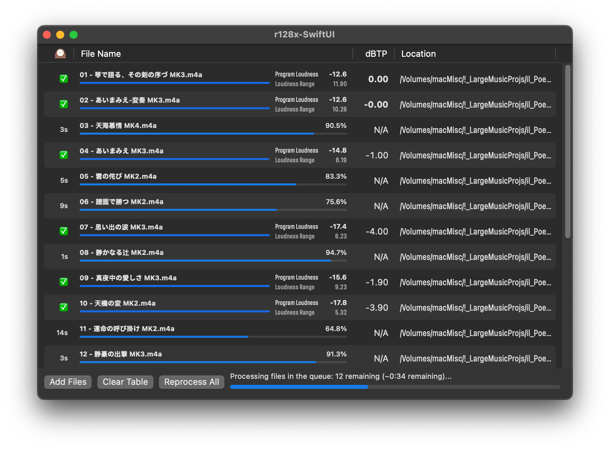

# r128x, a tool for loudness measurement of files on Mac OSX Intel. #
# with gui now !
#

r128x is released under GPLv3 license.

> For releases earlier than 0.4, please check the repo under the previous maintainer:
> - https://github.com/audionuma/r128x 

## Binaries ##
 
v0.4 2023-JUN-24 binaries can be found in the _release_ tab.

## Description ##
r128x is a tool for measuring Integrated Loudness, Loudness range and Maximum True Peak of audio files on the Mac OS X system with an Intel processor.

It uses libebur128 (https://github.com/jiixyj/libebur128) for the Integrated Loudness and Loudness Range measures.

It uses CoreAudio's AudioConverter service to oversample audio data and obtain the Maximum True Peak.

It uses CoreAudio ExtAudioFile's service to read the samples from an audio file.

You can build two different binaries from the sources : a command line utility (r128x-cli) and a graphical interface utility (r128x-swiftui).

## Installation ##
You can build the executables from the Xcode project, or use the provided executables.

Just drag the executable file to your hard drive.
/usr/local/bin/ should be a nice place to put the command line binary r128x-cli if you want it to be in your $PATH.

## Usage ##
r128x-cli /some/audio/file.wav
Will print out the file name, the Integrated Loudness in LUFS, the Loudness range in LU, the Maximum True Peak in dBTP.
Will print an error message in case of unsupported file or if an error occurs during processing.

r128x-swiftui supports drag and drop of audio files. You can also use the file selector.

## Issues ##
Channel mapping is static, using the default libebur128 channel mapping :
L / R / C / LFE / Ls / Rs.
You will have incorrect results if your file's channels mapping is different.
As r128x uses CoreAudio to read audio files, only file formats/codecs supported by CoreAudio are supported by r128x.
** CoreAudio may support new formats per certain macOS releases. Please file issues if new formats are implementable in r128x.**

## Notice regarding the end of the French translation support in this Repository ##

The current maintainer Shiki Suen can only use the following languages:

- English, Japanese, Simplified Chinese, Traditional Chinese

Therefore, the French localization has to be discontinued.

The App still offers the French UI (translated using DeepL). Pull Requests for improving French Translations are still welcomed.
